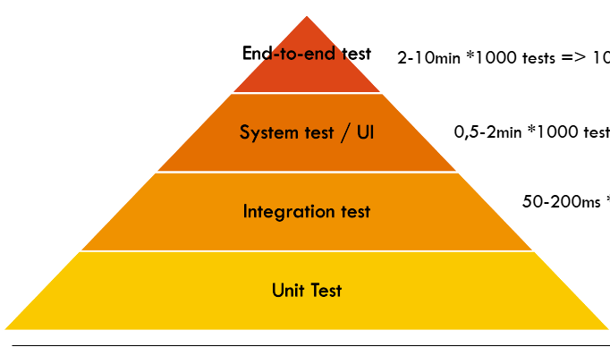
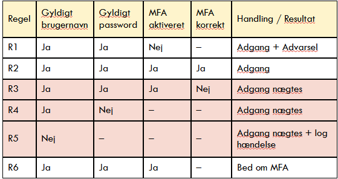

# it_sikkerhed_2026f
## Skole projekt Zealand Næstved

# Dag 1, Unit-test opgave
### Screenshot af mine egne unit-tests

### Screenshot af tests der kører i mit eget repo

 
 

# Dag 2, test teknikker
### FÆLLES EKSEMPEL
### Et login-system til en webapplikation
- Brugernavn + password
- Password skal være 8-20 tegn
- Konto låses efter 5 fejlede loginforsøg
- Brugere kan oprettes, opdateres og slettes (CRUD)
## Ækvivalens klasser
**Idéen:**
I stedet for at teste *alle* inputs, deler man dem op i grupper der opfører sig ens 
Eksempel: Password længde 
Regel: Password skal være 8-20 tegn
| Klasse  | Beskrivelse  |
|---------|--------------|
| Gyldig  | 8-20 tegn    |
| Ugyldig | 0-7 tegn     |
| Ugyldig | Over 20 tegn |

Istedet for at teste 100 passwords, tester jeg **ét fra hver klasse**
Testeeksempel:
- "Password123" -> gyldig
- "abc" -> ugyldig
- "123456789012345678901234567890" -> ugyldig  
**Hvorfor?**  
For korte eller lange passwords kan omgå validering og give svag sikkerhed.

## Grænseværdi test
**Idéen:**
Fejl sker ofte **lige ved grænserne**
Vi tester derfor lige omkring grænserne 
**Password længde (8-20)** 
Vi tester: 
| Test | Længde   | Forventet  |
|------|----------|------------|
| 7    | For kort | Afvist     |
| 8    | Ok       | Accepteret |
| 9    | Ok       | Accepteret |
| 19   | Ok       | Accepteret |
| 20   | Ok       | Accepteret |
| 21   | For lang | Afvist     |

**Hvorfor?**  
Forkerte grænser kan tillade:
- tomme passwords
- buffer overflow
- bypass af regler

## CRUD(L)
CRUD handler om datahåndtering - også en stor del af sikkerhed
### Login-systemets CRUD
| Operation | Eksempel                                 |
|-----------|------------------------------------------|
| Create    | Opret bruger                             |
| Read      | Se brugerprofil                          |
| Update    | Opdater brugerprofil (fx skift password) |
| Delete    | Slet bruger                              |
| (List)    | Vis alle brugere/brugerID's (admin)      |

### Sikkerhedsfokus:
- Må almindelige brugere slette konti?
- Kan en bruger opdatere andres data?
- Er adgang begrænset korrekt?
### Testeeksempel:
- ALmindelig bruger forsøger DELETE /user/5 -> afvist
- Admin forsøger samme -> tilladt

## Cycle process test
**Idéen**: Test hele livscycklusen, ikke kun én handling
### Login-cyklus
1. Bruger opretter konto
2. Logger ind korrekt
3. Logger ind forkert 5 gange
4. Konto låses
5. Admin låser konto op
6. Bruger logger ind igen

Vi tester flowet, ikke kun login-knappen.

**Hvorfor?**  
Mange sikkerhedsfejl opstår **mellem trin**, ikke i ét trin

## Test Pyramiden
**Idéen:** Ikke alle tests er lige dyre eller lige gode

### Klassisk testpyramide

### Login-eksempel:
- Unit test:  
Validerer password-længde
- Integration test: 
Login + DB + konto-lås
- UI test  
Bruger logger ind via browser

**Sikkerhedsperspektiv:**
Flest tests nederst -> hurtige, billige, sikre regler.

## Decision table test
**Idéen:** Når der er mange regler, laver man en tabel

### Login-beslutninger
| Password korrekt | Konto låst | Resultat |
|------------------|------------|----------|
| Ja               | Nej        | Login OK |
| Nej              | Nej        | Fejl     |
| Ja               | Ja         | Afvist   |
| Nej              | Ja         | Afvist   |
 
Du sikrer, at alle kombinationer er tænkt igennem

**Hvorfor?**  
IT-sikkerhed handler ofte om kombinationer af regler

## Konklusion
I et login system kan **ækvivalens klasser** bruges til at opdele password inputs i gyldige og ugyldige grupper. For korte eller lange passwords kan omgå validering og give svag sikkerhed. 
**Grænseværditest** anvendes til at teste minimum og maksimum password-længde. Vi tester på grænserne da fejl ofte sker omkring grænserne. Forkerte grænser kan tillade tomme passwords, buffer overflow, bypass af regler m.m.  
**CRUD(L)** tests anvendes til at sikre at datahåndtering fungerer optimalt og sikkert. Fx at det kun er admins der kan slette brugere og/eller redigere vigtige brugeroplysninger eller at registreringsprocessen virker.  
**Cycle process test** anvender test ifm. et helt flow igennem systemet som fx fra registrer bruger - login - opdater adgangskode - bekræft - logud  
**Test pyramiden** forklarer hvor lang tid de forskellige slags tests tager. Der findes en BOTTOM UP og en TOP DOWN version af pyramidernem alt afhængigt af hvilken approach man tager. Unit-tests er virkelig hurtige at gennemføre samt meget billige hvorimod end-to-end tests tager meget lang tid og er dyrere at gennemføre.  
**Decision table test** tester systemets adfærd ved at opstille en tabel med betingelser (fx input, regler, ja/nej valg), handlinger/resultater (hvad systemet skal gøre) og regler (kobinationer af betingelser og deres forventede resultater).   Eksemplet med login kan man fx opstille betingelserne: gyldigt brugernavn, gyldigt password, MFA aktiveret, MFA korrekt. Herefter kan man opstille regler i flere rows hvor man tester i alle mulige kombinationer. Derefter skriver man hvad systemet skal gøre i hver regel i "Handlinger / resultat" kolonnen.

## Security gates
### Skriv hvilke security gates jeg ville placere de forskellige tests under